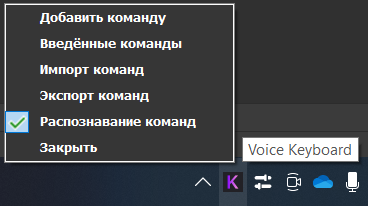
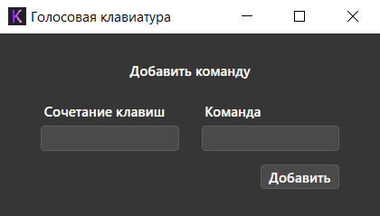
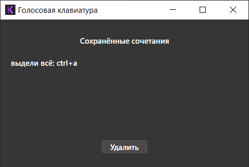

# Voice keyboard Windows

 \
The application allows you to press keyboard shortcuts by saying various commands.

Application features:

-   Add new commands for shortcut
-   Delete commands
-   View all saved commands with shortcuts
-   Export / import commands
-   Suspend execution of commands

For Windows 8 and upper

_Functional core by_ **_[DmitySH](https://github.com/DmitySH)_** \

